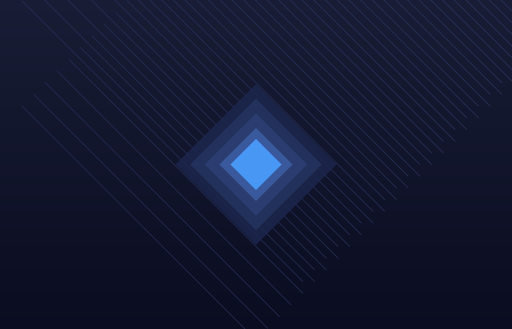

# Isometric Level Editor



A Vite + TypeScript isometric level editor with a built-in movement testing view. Use it to paint tile-based layouts, manage layers, and preview traversal behavior before exporting maps as JSON.

## Features
- 🎨 **Tile painting tools:** Brush and eraser with undo/redo history and per-layer selection.
- 🧱 **Layer-aware editing:** Toggle layer visibility and choose the active layer before placing tiles.
- 🔍 **Camera controls:** Mouse-wheel zoom and toolbar buttons for focusing on the canvas.
- 💾 **Persistence:** Save to localStorage (Ctrl+S), import/export JSON, or download the current level.
- 🗺️ **Map sizing:** Quickly switch between common grid sizes (8x8 up to 128x128) or clear the map.
- 🧭 **Movement tester:** Send the player to clicked tiles, tag cells as floor/blocker/slow, and visualize the resulting path.

## Getting started
1. Install dependencies:
   ```bash
   npm install
   ```
2. Start the dev server:
   ```bash
   npm run dev
   ```
3. Open the app in your browser (default Vite port is shown in the terminal, e.g., `http://localhost:5173`).

To create a production build, run `npm run build`, then preview it with `npm run preview`.

## Pixel asset generator (Imagen 3.0 via Gemini API)
- A Netlify Function at `/.netlify/functions/pixel-asset-generator` calls the Imagen 3.0 `generateImage` endpoint to render upload-ready sprite sheets.
- Assets are authored as transparent PNGs with 32x32px tiles, no gutters or drop-shadows, and gentle top-left lighting so they align with the editor’s 2:1 iso shading.
- Configure a `.env` or Netlify environment variable `GEMINI_API_KEY` with your Gemini key. The default model is the image-capable `imagen-3.0-generate-001`; override via the `model` payload field if Google adds newer Imagen variants.
- Run locally with Netlify CLI (`netlify dev`) and call from the front-end through `generatePixelAsset` in `src/assets/pixel/PixelAssetGeneratorClient.ts` (defaults to `http://localhost:8888`).
- For verbose diagnostics, set `DEBUG_GEMINI=1` or `PIXEL_ASSET_DEBUG=1` before running `netlify dev` to include request/response summaries in the function logs and responses.
- To call the function directly from the terminal, run `node scripts/debug-pixel-asset.mjs --prompt "..." --debug` (see the script help for options).
- The Pixel Asset Generator panel includes a Debug toggle that prints the debug payload in the output panel.

## Usage
- **Select tiles:** Click a sprite in the palette to set the active tile. Layers can be toggled or selected from the layer panel.
- **Paint/erase:** Choose the Brush (B) or Eraser (E) tool, then click or drag on the grid. Use Ctrl+Z / Ctrl+Y for undo/redo.
- **Resize or reset:** Pick a preset map size in the Map panel or use **Clear All** for a fresh grid.
- **Save & load:**
  - Save to browser storage with the disk icon or `Ctrl+S`.
  - Import a JSON level via the folder icon.
  - Download the current level as JSON with the download icon.
- **Movement testing:** Switch to the **Movement Tester** tab, load the current editor map, and label tiles as Floor, Blocker, or Slow. Use **Move Player** mode to click a destination and preview the path/animation.

## Project structure
- `src/index.ts` – bootstraps the editor, UI panels, and movement tester.
- `src/editor/` – core editor controller, tools, and history manager.
- `src/engine/` – canvas, camera, and rendering helpers for the isometric grid.
- `src/ui/` – UI panels for toolbar, layers, map controls, palette, view controls, and movement tester UI.
- `src/level/` – level model plus JSON serialization/loading.
- `src/assets/` – tile registry and asset management.
- `assets/` – static sprites and the README hero image (SVG).

## Keyboard shortcuts
- **B** – Brush tool
- **E** – Eraser tool
- **Ctrl+Z** – Undo
- **Ctrl+Y** / **Ctrl+Shift+Z** – Redo
- **Ctrl+S** – Save to localStorage
